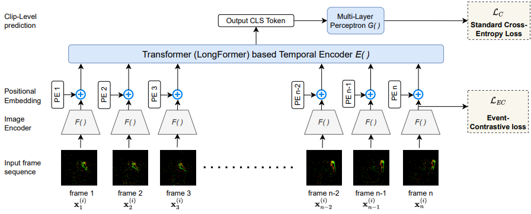

# EventTransAct


## Downloading dataset  
You can find instructions on downloading the 2 datasets used in the paper below  
DVS: https://research.ibm.com/interactive/dvsgesture/  
N-Epic-Kitchens: https://github.com/EgocentricVision/N-EPIC-Kitchens  

## Preparing dataset for DVS  
Clone snntorch repository:  
```
git clone https://github.com/jeshraghian/snntorch/tree/master
```
Go to the snntorch/snntorch/spikevision/spikedata folder and replace dvs_gesture.py by the dvs_gesture.py file found in the /DL folder of this repo  
